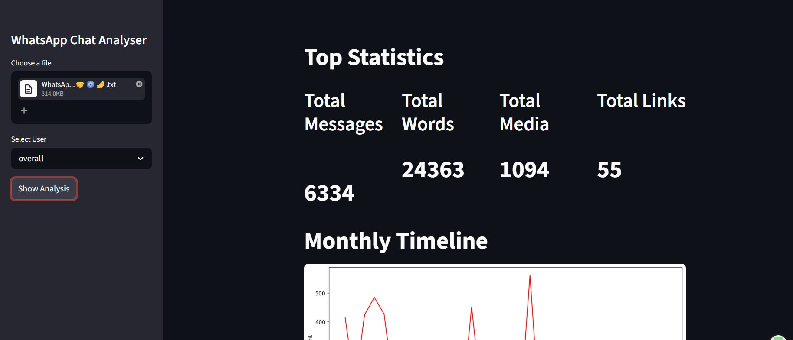
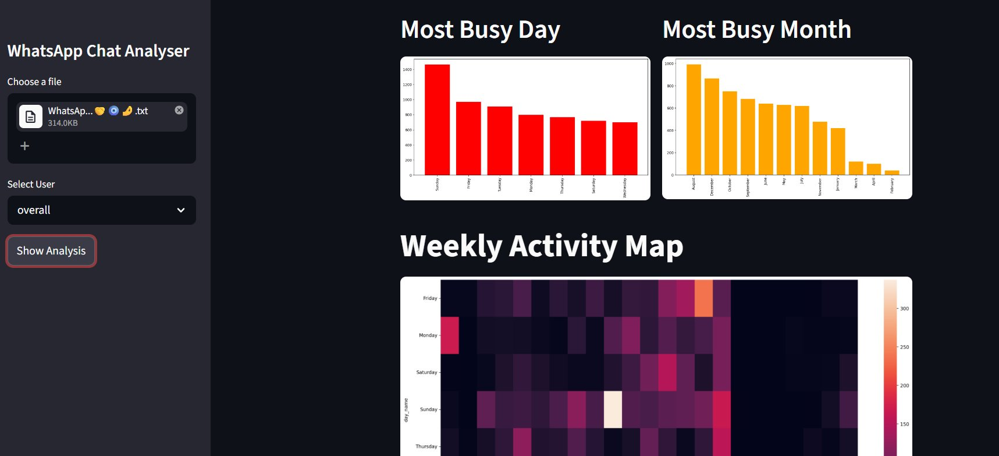

# WhatsApp Chat Analyser

Export any WhatsApp chat as a `.txt` file and drop it into this app. It parses the raw message format using regex, structures everything into a dataframe, and gives you a full breakdown of the conversation — who talks the most, when the group is most active, top words, emoji usage, and heatmaps by hour and month.

Works for both group chats and one-on-one conversations. I built it because I was curious about my own messaging patterns and wanted to do something useful with pandas and data visualization beyond tutorial datasets.




---

## How to run it

```bash
git clone https://github.com/KushRathod17/whatsapp-chat-analyser.git
cd whatsapp-chat-analyser
pip install -r requirements.txt
streamlit run app.py
```

**Exporting your chat from WhatsApp:**
Open any chat → three dots (top right) → More → Export Chat → Without Media. Upload the downloaded `.txt` file to the app.

---

## What it shows you

- **Top stats** — total messages, words, media files, and links shared
- **Timeline** — daily and monthly message volume over the full chat history
- **Activity heatmap** — hour-by-hour and day-by-day breakdown of when the chat is most active
- **Most active users** — ranked by message count (useful for group chats)
- **Word cloud** — most frequently used words, with stop words filtered out
- **Emoji analysis** — which emojis are used most, and by whom

You can filter all of this per user or view the full group together.

---

## How the parsing works

WhatsApp exports follow a consistent format:
```
DD/MM/YYYY, HH:MM - Name: message
```

The app uses regex to extract the date, time, sender, and message from each line. Edge cases like multi-line messages, media omitted tags, and system messages (someone left the group, etc.) are all handled before the dataframe gets built.

---

## Tech used

| Library | Purpose |
|---|---|
| Python | Core language |
| Pandas | Parsing and data manipulation |
| Matplotlib + Seaborn | Charts and heatmaps |
| Streamlit | Web interface |
| WordCloud | Word frequency visualization |
| Regex | Raw chat parsing |

---

## What I'd improve next

- Add support for 12-hour time format exports (currently handles 24hr)
- Sentiment analysis per user over time using VADER
- Export the full analysis as a PDF report
